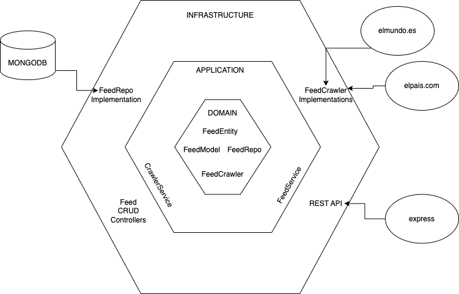

# Daily trends

## Getting started

1. Clone this repo
2. Create .env according to .env.example
3. `yarn install`

### Local development

- `yarn dev`

### Build

- `yarn build`

### Test

- `yarn test`

## Architecture
